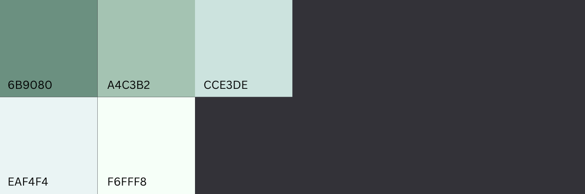

Monstera is elegantly designed, a green color scheme that focuses on being simple and easy on the eyes.

# Features 
- Simple: no configuration required and easy to use
- Dark and light backgrounds
- 256-colors terminal support
- Terminal colors support

# Screenshots

# Color Palette

# License
MIT License. See `LICENSE.txt` for more information.
